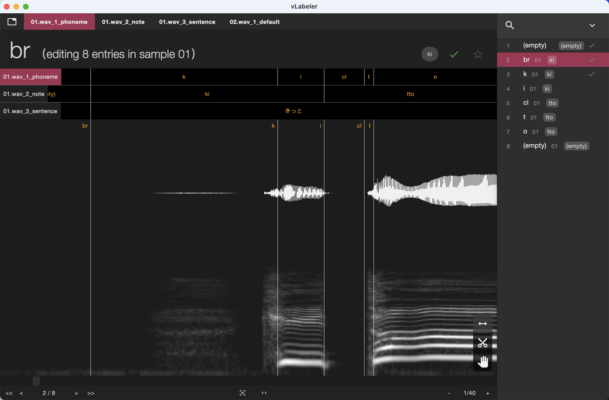

# vLabeler support for TextGrid

This repository contains a set of `labeler` and plugins for [vLabeler](https://github.com/sdercolin/vlabeler) to
support [TextGrid](https://www.fon.hum.uva.nl/praat/manual/TextGrid.html) files.

## Requirements
`vLabeler` 1.0.0-beta3 or later.

## Contents

- `labelers`
    - `textgrid.labeler.json`: labeler for TextGrid files
- `plugins`
    - `macro`
        - `textgrid-mark-tier-relations`: Used to mark parent-child relations between existing tiers
        - `textgrid-merge-to-next-tier`: Used to create/update a parent tier using a child tier with relations tags
        - `textgrid-manage-module`: Used to manage modules (sub-projects) in the project
- `src`: JavaScript source code for labelers. Not needed for using the labelers.

## Important notes

1. The labeler currently only supports the `IntervalTier` tier, so `PointTier` will be ignored and will not be exported.
   Please backup your original TextGrid files before using the labeler if you have `PointTier` tiers.
2. The labeler only recognize `.TextGrid` extension, so please rename your files if they have other extensions in prior.

## Preview



## Download

See [Releases](https://github.com/sdercolin/vlabeler-textgrid/releases).

## Installation

1. Open Menu `Settings` -> `Labelers...`
2. Click `+` and select the downloaded `textgrid.labeler.json` file
3. Open Menu `Tools` -> `Batch Edit` -> `Manage Plugins...`
4. Click `+` and select the all the downloaded `plugin.json` files in the `plugins` folder
5. Instead of 4, you can also click the `Open directory` button and paste all the plugin folders into the opened `macro`
   folder.

## Project creation

1. Make your files look like the following structure:
    ```
    your_project
    ├── wav
    │   ├── file1.wav
    │   ├── file2.wav
    │   └── file3.wav
    └── TextGrid
        ├── file1.TextGrid
        ├── file2.TextGrid
        └── file3.TextGrid
    ```
   If you don't have TextGrid files yet, you can leave the `TextGrid` folder empty.
2. Open the `New project` page of vLabeler
3. Select the `your_project` folder (its name can be any text) as the `SampleDirectory`.
4. Select Labeler `TextGrid labeler`
5. If you have different names for the `wav` and `TextGrid` folders, you can change them in the labeler's settings (the
   gear button next to it).
6. Complete other settings as you wish and create the project.

## Adjust existing TextGrid files

If you have existing TextGrid files, you can see several module tabs in the created project, like:

```
- file1.wav_1_tier1
- file1.wav_1_tier2
- file2.wav_1_tier1
- file2.wav_1_tier2
```

The name of the module should be in the format of `<file_name>.wav_<tier_index>_<tier_name>`.

If your tiers are not related, which means you don't need to make sure the boundaries in different tiers are aligned,
you can just do the adjustment in each module independently.

However, in many cases, we have parent-child relations between tiers, like:

```
phoneme:  | a | k | a | s | a |
note:     | a |   ka  |   sa  |
sentence: |     a ka sa       |
```

So we may want to adjust the boundaries synchronously in all the tiers related.

To do this, we can use the plugins with the following steps:

1. Run `TextGrid - Mark tier relations` plugin. Please read carefully the instructions in the plugin dialog and fill in
   the correct variables. After execution, parent entry names will be set as tags of the child entries. e.g.
    ```
    phoneme:  |    a (a)     |  k (ka) | a (ka)  |  s (sa) | a (sa)  |
    note:     | a (a ka sa)  |   ka (a ka sa)    |   sa (a ka sa)    |
    sentence: |                     a ka sa                          |
    ```
2. Adjust the boundaries and label names in the most detailed tier (e.g. `phoneme` tier in the example above). After
   adjustment, it may look like:
    ```
    phoneme:  |    a (a)      | k (ka) | a (ka) |   s (sa) | a (sa)  |
    note:     | a (a ka sa)  |   ka (a ka sa)    |   sa (a ka sa)    |
    sentence: |                     a ka sa                          |
    ```
3. Run `TextGrid - Merge to update next tier` plugin in the most detailed tier. We will get the next tier updated like:
    ```
    phoneme:  |    a (a)      | k (ka) | a (ka) |   s (sa) | a (sa)  |
    note:     | a (a ka sa)   |  ka (a ka sa)   |   sa (a ka sa)     |
    sentence: |                     a ka sa                          |
    ```
4. Repeat step 2 and 3 until the top tier is updated. The `TextGrid - Merge to update next tier` plugin also have settings to allow batch process for multiple tiers and/or multiple sample files. Please check the plugin's settings for details.

## Create TextGrid files from scratch

If we want to create TextGrid files from scratch, we get a empty project including tabs like:

```
- file1.wav_1_default
- file2.wav_1_default
```

`default` is a default tier name. We can rename it by the `TextGrid - Manage module` plugin.

If we want to create tiers with parent-child relations, we can do the same steps 2 and 3 as the previous section.

Note that the plugin `TextGrid - Merge to update next tier` will create a new tier if the given next tier doesn't exist,
so you don't need to create the next tier manually.

You can add, remove, rename and duplicate modules by the `TextGrid - Manage module` plugin as you like, but please note
that the plugin doesn't block all the possible errors, so you will need to double-check the module names before running
other plugins or export.

## Export TextGrid files

You can choose any of the following methods to export TextGrid files:

1. Menu `File` -> `Export...`: Export the TextGrid file for the current wav file to a certain file.
2. Menu `File` -> `Export Overwriting`: Export the TextGrid file for the current wav file to the original TextGrid
   file (if not existing, create as `<project>/TextGrid/<wavFileName>.TextGrid`).
3. Menu `File` -> `Export Overwriting All`: Export all the TextGrid files in the project to the corresponding original
   TextGrid files.


## Tips

1. You can click the module name labels on the left side of the tier view to switch to another module.
2. You can click any entry in the tier view to switch to that tier and jump to the entry.
3. You can use menu `Navigate` -> `Go to Next/Previous Sub-project` to switch between tiers. You can also set the
   keyboard shortcuts for these actions in the `Settings` -> `Preferences...` -> `Keymap` -> `Key actions` page.
4. Dragging when multiple tiers exist will be snapped to entries in other tiers.
5. You can use the [plugin quick launch feature](https://github.com/sdercolin/vlabeler#quickly-launch-batch-edit-plugins) to easily run plugins with a set of parameters.
